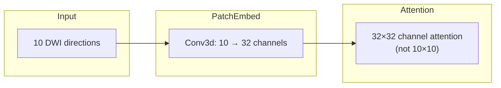

# 3D Restormer Implementation Review

## 1. 3D MDTA (Transposed Attention) Analysis

**Status: Correct implementation with clarification needed**

Your `Attention3D` class correctly implements transposed attention with linear complexity:

```151:173:src/restormer_hybrid/model.py
    def forward(self, x):
        b, c, d, h, w = x.shape
        
        qkv = self.qkv_dwconv(self.qkv(x))
        q, k, v = qkv.chunk(3, dim=1)
        
        q = rearrange(q, 'b (head c) d h w -> b head c (d h w)', head=self.num_heads)
        k = rearrange(k, 'b (head c) d h w -> b head c (d h w)', head=self.num_heads)
        v = rearrange(v, 'b (head c) d h w -> b head c (d h w)', head=self.num_heads)
        
        q = F.normalize(q, dim=-1)
        k = F.normalize(k, dim=-1)
        
        # Transposed attention: (C/heads, D*H*W) @ (D*H*W, C/heads) -> (C/heads, C/heads)
        attn = (q @ k.transpose(-2, -1)) * self.temperature
        attn = attn.softmax(dim=-1)
        
        out = attn @ v
```

**Key insight:** The attention computes a `(C/heads) x (C/heads)` covariance matrix where C is the **latent feature channels** (32, 64, 128, 256 at different levels), NOT the 10 DWI directions directly. This is intentional:




**Complexity Analysis:**

- Standard spatial attention: O((D×H×W)²) = O(1.5B) operations for 96×128×128
- Transposed channel attention: O(C² × D×H×W) = O(32² × 1.5M) = O(1.5M) operations
- This achieves linear complexity relative to spatial voxels

**Recommendation:** If you specifically want cross-direction covariance (10×10), you would need a separate direction-wise attention block before patch embedding. The current design captures this implicitly through learned channel interactions.

---

## 2. Hierarchical Scaling Review

**Status: Critical change recommended for tractography**

### 2.0 Reduce to 3 Levels for Tractography (HIGH PRIORITY)

For input size 128×128×96, the current 4-level hierarchy is too aggressive for tractography applications:


| Levels                 | Bottleneck Size | Spatial Locations | Compression |
| ---------------------- | --------------- | ----------------- | ----------- |
| 4 levels (current)     | 16×16×12        | 3,072             | 512×        |
| 3 levels (recommended) | 32×32×24        | 24,576            | 64×         |


**Why this matters for tractography:**

1. **Fiber crossing preservation**: At 16×16×12 bottleneck with ~2mm voxels, spatial pooling spans ~32mm—larger than most fiber bundle diameters. Crossing fibers lose distinction.
2. **Partial volume effects**: 512× compression blurs WM/GM/CSF boundaries critical for accurate tract termination.
3. **High b-value sensitivity**: b=2500 data has subtle angular differences needed for crossing fiber reconstruction that may be discarded at extreme compression.

**Required changes for 3-level architecture:**

**config.yaml:**

```yaml
model:
  num_blocks: [2, 2, 4]    # 3 levels instead of 4
  heads: [1, 2, 4]         # Match num_blocks length
```

**model.py:** Remove Level 3 encoder/decoder:

- Remove `down2_3`, `encoder_level3`, `down3_4` 
- Remove `up4_3`, `reduce_chan_level3`, `decoder_level3`, `up3_2`
- Connect `down1_2` output directly to latent
- Connect latent directly to `up2_1`
- Update channel dimensions accordingly

**Progressive learning constraint update:** With 3 levels (2 downsampling ops), input dimensions must be divisible by 2² = 4 instead of 8.

---

### 2.1 Downsampling/Upsampling Alignment

The `Downsample3D` and `Upsample3D` modules have a subtle asymmetry:

```224:253:src/restormer_hybrid/model.py
class Downsample3D(nn.Module):
    def __init__(self, n_feat):
        super(Downsample3D, self).__init__()
        self.body = nn.Sequential(
            nn.Conv3d(n_feat, n_feat * 2, kernel_size=3, stride=2, padding=1, bias=False)
        )

class Upsample3D(nn.Module):
    def __init__(self, n_feat):
        super(Upsample3D, self).__init__()
        self.body = nn.Sequential(
            nn.ConvTranspose3d(n_feat, n_feat // 2, kernel_size=2, stride=2, bias=False)
        )
```

**Issue:** For odd input dimensions, size mismatch can occur:


| Level   | Downsample (k=3, s=2, p=1) | Upsample (k=2, s=2) | Skip Match   |
| ------- | -------------------------- | ------------------- | ------------ |
| 96 → 48 | floor((96+2-3)/2)+1 = 48   | 48×2 = 96           | OK           |
| 97 → 49 | floor((97+2-3)/2)+1 = 49   | 49×2 = 98           | **MISMATCH** |


**Fix:** Add `output_padding` to `ConvTranspose3d` or use interpolation-based upsampling:

```python
class Upsample3D(nn.Module):
    def __init__(self, n_feat):
        super(Upsample3D, self).__init__()
        self.body = nn.Sequential(
            nn.Conv3d(n_feat, n_feat // 2, kernel_size=1, bias=False),
        )
    
    def forward(self, x, target_size=None):
        x = self.body(x)
        if target_size is not None:
            x = F.interpolate(x, size=target_size, mode='trilinear', align_corners=False)
        else:
            x = F.interpolate(x, scale_factor=2, mode='trilinear', align_corners=False)
        return x
```

### 2.2 Skip Connection Analysis

Skip connections are correctly implemented:

```426:439:src/restormer_hybrid/model.py
        # Decoder
        inp_dec_level3 = self.up4_3(latent)
        inp_dec_level3 = torch.cat([inp_dec_level3, out_enc_level3], dim=1)
        inp_dec_level3 = self.reduce_chan_level3(inp_dec_level3)
        out_dec_level3 = self.decoder_level3(inp_dec_level3)
        
        inp_dec_level2 = self.up3_2(out_dec_level3)
        inp_dec_level2 = torch.cat([inp_dec_level2, out_enc_level2], dim=1)
        inp_dec_level2 = self.reduce_chan_level2(inp_dec_level2)
```

**Verified:** Channel reduction with 1×1 Conv3d correctly reduces concatenated channels.

---

## 3. Progressive Learning Readiness

**Status: Fully patch-size agnostic**

Checked all layers for fixed-size dependencies:


| Component     | Implementation                       | Agnostic? |
| ------------- | ------------------------------------ | --------- |
| LayerNorm3D   | Dynamic reshape via `to_2d`/`to_5d`  | Yes       |
| Attention3D   | einops rearrange with runtime shapes | Yes       |
| FeedForward3D | All Conv3d, no Linear                | Yes       |
| Patch Embed   | Conv3d with padding                  | Yes       |
| Down/Upsample | Conv3d/ConvTranspose3d               | Yes       |


**Constraint (after 3-level change):** Input spatial dimensions must be divisible by 2² = 4 (2 downsampling levels). For progressive training, ensure patch sizes follow: 16→32→64→128 etc.

**No changes needed** for progressive learning support.

---

## 4. MRI-Specific Normalization

**Status: Functional but suboptimal for MRI**

Current `LayerNorm3D` normalizes across the **channel dimension** for each voxel:

```75:91:src/restormer_hybrid/model.py
class LayerNorm3D(nn.Module):
    def __init__(self, dim, LayerNorm_type='WithBias'):
        super(LayerNorm3D, self).__init__()
        if LayerNorm_type == 'BiasFree':
            self.body = BiasFree_LayerNorm(dim)
        else:
            self.body = WithBias_LayerNorm(dim)

    def forward(self, x):
        d, h, w = x.shape[-3:]
        return to_5d(self.body(to_2d(x)), d, h, w)
```

**Issue:** This computes statistics over C=32 channel values per voxel, which may be unstable for small channel counts.

**Recommended alternative:** Group Normalization or Instance Normalization for 3D MRI:

```python
class LayerNorm3D(nn.Module):
    def __init__(self, dim, LayerNorm_type='WithBias'):
        super(LayerNorm3D, self).__init__()
        if LayerNorm_type == 'GroupNorm':
            num_groups = min(8, dim)
            self.body = nn.GroupNorm(num_groups, dim, affine=True)
            self.use_reshape = False
        elif LayerNorm_type == 'InstanceNorm':
            self.body = nn.InstanceNorm3d(dim, affine=True)
            self.use_reshape = False
        elif LayerNorm_type == 'BiasFree':
            self.body = BiasFree_LayerNorm(dim)
            self.use_reshape = True
        else:
            self.body = WithBias_LayerNorm(dim)
            self.use_reshape = True

    def forward(self, x):
        if self.use_reshape:
            d, h, w = x.shape[-3:]
            return to_5d(self.body(to_2d(x)), d, h, w)
        return self.body(x)
```

---

## 5. Memory Efficiency

**Status: Several optimizations possible**

### 5.1 Identified "Tensor Ghosts"

**A. Reconstruction accumulator on CPU** ([reconstruction.py](src/restormer_hybrid/reconstruction.py)):

```39:73:src/restormer_hybrid/reconstruction.py
    sum_preds = np.zeros((num_vols, *spatial_dims), dtype=np.float32)  # CPU array
    ...
    for pred_idx in range(n_preds):
        ...
        pred_volume = reconstructed.squeeze(0).squeeze(0).detach().cpu().numpy()  # GPU→CPU each iteration
        sum_preds[vol_idx] += pred_volume
```

**Fix:** Keep accumulator on GPU:

```python
sum_preds = torch.zeros((num_vols, *spatial_dims), dtype=torch.float32, device=device)
...
sum_preds[vol_idx] += reconstructed.squeeze(0).squeeze(0)
# Only move to CPU at the end
reconstructed = (sum_preds / n_preds).cpu().numpy()
```

**B. Unnecessary clone in reconstruction** ([reconstruction.py:59](src/restormer_hybrid/reconstruction.py)):

```python
data_masked = data_device.clone()  # Full volume clone per prediction
```

**Fix:** Clone only the target volume:

```python
target_vol_masked = data_device[vol_idx:vol_idx+1] * mask_tensor
data_masked = torch.cat([
    data_device[:vol_idx],
    target_vol_masked,
    data_device[vol_idx+1:]
], dim=0).unsqueeze(0)
```

### 5.2 Skip Connection Memory

With 3-level architecture, the encoder stores 3 feature maps until decoder uses them. For input (B, 10, 96, 128, 128) with dim=32:


| Level  | Channels | Spatial    | Memory (fp32) |
| ------ | -------- | ---------- | ------------- |
| enc1   | 32       | 96×128×128 | 200 MB        |
| enc2   | 64       | 48×64×64   | 50 MB         |
| latent | 128      | 24×32×32   | 12.5 MB       |


**Note:** The 3-level architecture reduces peak memory compared to 4 levels (no 256-channel enc3 layer stored).

**Optional:** Use gradient checkpointing for encoder levels:

```python
from torch.utils.checkpoint import checkpoint

def forward(self, inp_img):
    inp_enc_level1 = self.patch_embed(inp_img)
    out_enc_level1 = checkpoint(self.encoder_level1, inp_enc_level1, use_reentrant=False)
    # ... continue with checkpointing for memory-constrained training
```

---

## Summary of Required Changes


| Priority | Issue                               | File                  | Fix                                 |
| -------- | ----------------------------------- | --------------------- | ----------------------------------- |
| Critical | 4-level hierarchy too aggressive    | model.py, config.yaml | Reduce to 3 levels for tractography |
| High     | GPU→CPU transfers in reconstruction | reconstruction.py     | Keep accumulator on GPU             |
| Medium   | Odd dimension mismatch risk         | model.py              | Use interpolation-based upsampling  |
| Medium   | Per-voxel LayerNorm instability     | model.py              | Add GroupNorm/InstanceNorm option   |
| Low      | Full clone per prediction           | reconstruction.py     | Clone only target volume            |
| Optional | Memory for large volumes            | model.py              | Add gradient checkpointing          |


