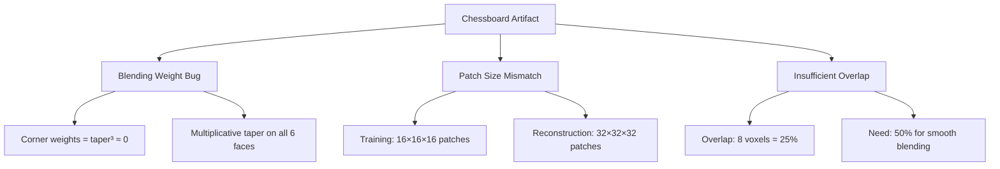

# Fix Chessboard Reconstruction Artifacts

## Root Cause Analysis

The chessboard pattern is caused by three interrelated issues:




### Issue 1: Blending Weight Bug (Critical)

In [reconstruction.py](src/restormer_hybrid/reconstruction.py) lines 163-169, the cosine taper is applied **multiplicatively** to all 6 faces:

```python
for i in range(overlap):
    weights[i, :, :] *= taper[i]      # -x face
    weights[-(i + 1), :, :] *= taper[i]  # +x face
    # ... same for y and z
```

**Problem**: At corners, weight = `taper[i]³` ≈ 0. At edges, weight = `taper[i]²`. This creates severe underweighting at patch boundaries.

### Issue 2: Training/Reconstruction Mismatch


| Phase          | Patch Size | Source              |
| -------------- | ---------- | ------------------- |
| Training       | 16×16×16   | config.yaml line 64 |
| Reconstruction | 32×32×32   | config.yaml line 41 |


The model was trained on **tiny patches** (16³ = 4,096 voxels) but must reconstruct **8× larger** patches (32³ = 32,768 voxels). The receptive field and learned features don't transfer well.

### Issue 3: Insufficient Overlap

- **Current**: overlap=8, stride=24 → **25% overlap**
- **Needed**: overlap=16, stride=16 → **50% overlap** for smooth Gaussian blending

## Fixes

### Fix 1: Replace Blending Weights with Gaussian Window (Critical)

Replace the multiplicative cosine taper with a proper 3D Gaussian window:

```python
def _create_blend_weights(patch_size, sigma_ratio=0.25):
    """Create 3D Gaussian blending weights."""
    center = patch_size / 2
    sigma = patch_size * sigma_ratio
    
    x = np.arange(patch_size) - center
    gaussian_1d = np.exp(-0.5 * (x / sigma) ** 2)
    
    # Outer product for 3D Gaussian
    weights = np.einsum('i,j,k->ijk', gaussian_1d, gaussian_1d, gaussian_1d)
    return weights.astype(np.float32)
```

### Fix 2: Match Reconstruction Patch Size to Training

Change [config.yaml](src/restormer_hybrid/config.yaml) line 41:

```yaml
reconstruct:
  patch_size: 16  # Match training patch size
  overlap: 8      # 50% overlap for 16×16×16 patches
```

### Fix 3: Increase Overlap to 50%

For proper blending, use **50% overlap** (stride = patch_size / 2):


| Patch Size | Overlap | Stride | Coverage |
| ---------- | ------- | ------ | -------- |
| 16         | 8       | 8      | 50%      |
| 32         | 16      | 16     | 50%      |


### Optional: Implement Progressive Learning (Future)

Per [ideas.md](src/restormer_hybrid/ideas.md), the original Restormer uses progressive patch sizes during training:

- Stage 1: 32³ → local noise statistics
- Stage 2: 64³ → structural boundaries
- Stage 3: 96³ → long-range tracts

This requires modifying the data loader to dynamically resize patches based on epoch.

## Implementation Priority

1. **Fix blending weights** (immediate fix for chessboard)
2. **Set reconstruction patch_size = training patch_size = 16**
3. **Set overlap = patch_size / 2 = 8**
4. **Clean up debug instrumentation** (from previous OOM fix)

## Files to Modify

- [reconstruction.py](src/restormer_hybrid/reconstruction.py): Replace `_create_blend_weights()` with Gaussian window
- [config.yaml](src/restormer_hybrid/config.yaml): Update `patch_size` and `overlap` in reconstruct section
- [fit.py](src/restormer_hybrid/fit.py): Remove debug logging (cleanup)
- [model.py](src/restormer_hybrid/model.py): Remove debug logging (cleanup)

