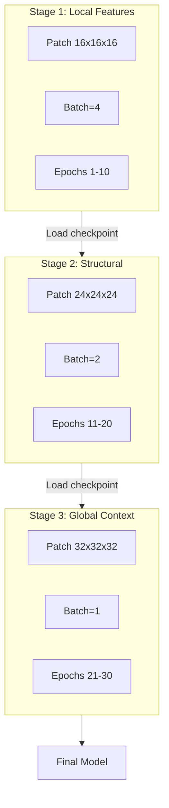

# Progressive Learning with AMP for 3D Restormer

## Memory Analysis

Current constraints:

- GPU: 10.75GB total, ~9GB used by other processes
- Available: ~1-2GB for training

With AMP (float16):

- Memory reduced by ~40-50%
- Enables larger patches without OOM


| Stage | Patch | Batch | Voxels/batch | Est. Memory (AMP) |
| ----- | ----- | ----- | ------------ | ----------------- |
| 1     | 16³   | 4     | 16,384       | ~2GB              |
| 2     | 24³   | 2     | 27,648       | ~3GB              |
| 3     | 32³   | 1     | 32,768       | ~4GB              |


## Architecture




## Implementation

### 1. Add AMP to Training ([fit.py](src/restormer_hybrid/fit.py))

Add `torch.amp.GradScaler` and `autocast` context manager:

```python
def fit_model(
    model,
    optimizer,
    scheduler,
    train_loader,
    num_epochs=10,
    device="cuda",
    checkpoint_dir=".",
    loss_dir=None,
    use_amp=True,  # NEW: Enable AMP by default
):
    scaler = torch.amp.GradScaler(enabled=use_amp and device == "cuda")
    
    for epoch in range(...):
        for batch_idx, (x, mask, noisy_target_volume) in enumerate(train_loader):
            optimizer.zero_grad()
            
            with torch.amp.autocast(device_type="cuda", enabled=use_amp):
                x_recon = model(x)
                loss = masked_mse_loss(x_recon, noisy_target_volume, mask)
            
            scaler.scale(loss).backward()
            scaler.step(optimizer)
            scaler.update()
```

### 2. Add Progressive Config ([config.yaml](src/restormer_hybrid/config.yaml))

Add `progressive` section under `dbrain.train`:

```yaml
dbrain:
  train:
    use_amp: true  # Enable mixed precision
    progressive:
      enabled: true
      stages:
        - patch_size: 16
          batch_size: 4
          epochs: 10
          step: 4
        - patch_size: 24
          batch_size: 2
          epochs: 10
          step: 6
        - patch_size: 32
          batch_size: 1
          epochs: 10
          step: 8
```

### 3. Implement Stage Loop ([run.py](src/restormer_hybrid/run.py))

Add `fit_progressive()` function:

```python
def fit_progressive(model, settings, noisy_data, original_data, brain_mask, checkpoint_dir, loss_dir):
    """Train model progressively with increasing patch sizes."""
    stages = settings.train.progressive.stages
    
    for stage_idx, stage in enumerate(stages):
        logging.info(f"Starting Stage {stage_idx + 1}/{len(stages)}: "
                    f"patch={stage.patch_size}, batch={stage.batch_size}")
        
        # Create dataset for this stage
        train_set = TrainingDataSet(
            data=noisy_data,
            patch_size=stage.patch_size,
            step=stage.step,
            ...
        )
        train_loader = DataLoader(train_set, batch_size=stage.batch_size, shuffle=True)
        
        # Create optimizer (reset momentum for new stage)
        optimizer = torch.optim.Adam(model.parameters(), lr=settings.train.learning_rate)
        
        # Stage checkpoint directory
        stage_checkpoint_dir = os.path.join(checkpoint_dir, f"stage_{stage_idx + 1}")
        
        fit_model(
            model=model,
            optimizer=optimizer,
            train_loader=train_loader,
            num_epochs=stage.epochs,
            use_amp=settings.train.use_amp,
            checkpoint_dir=stage_checkpoint_dir,
        )
```

### 4. Update Reconstruction Patch Size

Match reconstruction to final training stage:

```yaml
reconstruct:
  patch_size: 32  # Match Stage 3
  overlap: 16     # 50% overlap
```

## Key Implementation Notes

- **Gradient Scaler State**: Save/restore `scaler.state_dict()` in checkpoints for mid-stage resume
- **Memory Safety**: Clear cache between stages with `torch.cuda.empty_cache()`
- **Learning Rate**: Consider lower LR for later stages (already partially learned features)
- **Step Size**: Increase step proportionally with patch size to maintain similar dataset size
- **Checkpoint Naming**: Separate directories per stage for easy resume

## Fallback Strategy

If Stage 3 (32³) still OOMs:

1. Reduce batch to 1 (already planned)
2. Enable gradient checkpointing (`torch.utils.checkpoint`)
3. Fall back to 28³ as intermediate size

## Files to Modify

- [fit.py](src/restormer_hybrid/fit.py): Add AMP support, scaler checkpoint
- [config.yaml](src/restormer_hybrid/config.yaml): Progressive config, use_amp flag
- [run.py](src/restormer_hybrid/run.py): Add `fit_progressive()` function

