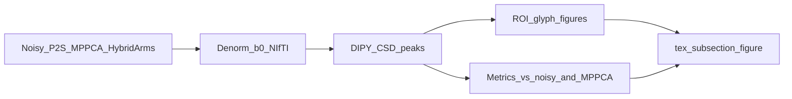

# Stanford CSD fixel corroboration (LNNN Figs. 10–11)

## Summary

Tutor ask (Aguayo-González et al., Front. Neuroinform. 2024): corroborate how **our denoising** affects the **CSD fixel outputs** shown in their Figs. 10–11 (crossing-fiber continuity / interruptions; gyral-blade fanning). We will **not** reimplement LNNN. Instead: fix **DIPY CSD + peaks**, vary the **input DWI** (noisy vs denoised arms), produce qualitative glyph figures + no-GT proxy metrics, and add a short paper subsection.

## Decisions (resolved)

| Topic         | Decision                                                                                            | Rationale                                                     |
| ------------- | --------------------------------------------------------------------------------------------------- | ------------------------------------------------------------- |
| Estimator     | DIPY CSD only (`auto_response` → `ConstrainedSphericalDeconvModel` → `peaks_from_model`)            | Reproducible; matches CSD arm of Figs. 10–11                  |
| Deliverable   | Paper-ready figure + short subsection                                                               | Tutor-facing evidence in manuscript                           |
| Figure arms   | Noisy, MP-PCA, P2S, DRCNet-3D K=16, Restormer-3D K=16, Restormer-3D large, Res-CNN-2D, Restormer-2D | Broad comparison; MDS2S deferred                              |
| Checkpoints   | Reuse existing Stanford 3D/P2S; **train missing** Stanford arms                                     | Confirmed gaps in `driver_events.jsonl`                       |
| Metrics       | Qualitative + proxies vs **noisy** and vs **MP-PCA**                                                | No fixel GT on Stanford                                       |
| Volume export | Denorm → prepend real b0s → 4D NIfTI                                                                | Required for valid CSD                                        |
| FOV           | Training crop (`take_x/y/z` Stanford profile)                                                       | Consistent with denoising protocol                            |
| Package       | [`src/paper_eval/`](src/paper_eval/)                                                                | Parallel to [`dti_metrics.py`](src/paper_eval/dti_metrics.py) |
| Peak protocol | max 3 peaks, relative threshold 0.2 (LNNN-matched)                                                  | Cite Aguayo-González et al.                                   |
| ROIs / viz    | Manual ROI YAML after scout + matplotlib glyphs                                                     | Reproducible paper PNGs                                       |

## Out of scope / deferred

- Reproducing LNNN / AxonNet weights
- Full native FOV reconstruction
- ISBI phantom Canales-style GT fixel suite
- MDS2S in the fixel figure
- Tractography

## What already exists vs missing

**Reuse (Stanford already succeeded):**

- `drcnet_stanford_rgs_final`, `restormer_stanford_rgs_final` (prefer June rerun registry [`tmp/paper_final_k16_rerun_20260628T042410Z/`](tmp/paper_final_k16_rerun_20260628T042410Z/) when present)
- `p2s_stanford_dipy_final` (already writes NIfTI)

**Must run (confirmed missing Stanford):**

- MP-PCA Stanford (only `mppca_dbrain_final` exists)
- Res-CNN-2D Stanford
- Restormer-2D Stanford ([`rerun_k16_restormer2d_ablation.sh`](experiments/rerun_k16_restormer2d_ablation.sh) is D-Brain-only; `run2d_hybrid` currently D-Brain-only)
- Restormer-3D large Stanford ([`rerun_k16_restormer3d_large.sh`](experiments/rerun_k16_restormer3d_large.sh) is D-Brain-only)

## Architecture

## Files and packages to touch

- [`src/paper_eval/dti_metrics.py`](src/paper_eval/dti_metrics.py) — pattern to mirror for maps/errors/save
- **Create** `src/paper_eval/csd_fixels.py` — CSD fit, peaks, proxy metrics, save JSON
- **Create** `src/paper_eval/export_denoised_nifti.py` (or helper used by reconstruct) — denorm + b0 prepend + `save_nifti`
- **Create** `src/paper_eval/plot_fixels.py` — matplotlib glyph panels for frozen ROIs
- **Create** `src/paper_eval/stanford_fixel_rois.yaml` — slice/bbox indices (filled after scout)
- **Modify** [`src/restormer_hybrid_rgs/run.py`](src/restormer_hybrid_rgs/run.py) / [`src/drcnet_hybrid_rgs/run.py`](src/drcnet_hybrid_rgs/run.py) (and 2D hybrids) — optional `reconstruct.save_denoised_nifti=true`
- **Modify** [`src/restormer_hybrid_rgs/run2d_hybrid.py`](src/restormer_hybrid_rgs/run2d_hybrid.py) (+ DRCNet 2D twin if needed) — add `--dataset stanford` + `stanford` config profile for 2D
- **Create** `src/paper_eval/baselines/mppca_stanford_run.py` or extend [`mppca_run.py`](src/paper_eval/baselines/mppca_run.py) for Stanford (no GT required)
- **Create** `experiments/rerun_k16_stanford_fixel_arms.sh` — missing Stanford trains + export + CSD pipeline
- **Create** `tmp/paper_final_k16_out/writing/026_stanford_csd_fixels.md` — LaTeX insert prompt
- **Modify** [`paper/Sepulveda_dwmri_restormer.tex`](paper/Sepulveda_dwmri_restormer.tex) — subsection + figure (after results)

## Implementation steps (ordered)

1. **NIfTI export helper** — From reconstructed `(X,Y,Z,V_dwi)` + stored norm params: invert min–max, prepend Stanford b0s from DIPY loader, write `denoised_<arm>.nii.gz` with affine; keep matching bvals/bvecs. Hook via `--set stanford.reconstruct.save_denoised_nifti=true` (and D-Brain optional). Tech debt comment if crop affine is approximate.
2. **Stanford 2D path** — Extend `run2d_hybrid` to accept `stanford` with the same K=16 Hybrid RGS knobs as the 3D Stanford finals (seed `91022`, G=150, K=16, etc.).
3. **Missing-arm script** — Shell mirroring existing rerun scripts:
   - `mppca_stanford_final`
   - `drcnet`/`restormer` **2D** Stanford Res-CNN-2D + Restormer-2D
   - `restormer_stanford_3d_large2M_k16` with large model args + memory-safe progressive batches
   - Reuse/export NIfTI for existing DRCNet/Restormer-3D/P2S via `--skip-train --checkpoint ...`
4. **CSD module** — Frozen: SH order 8 (or DIPY default for single-shell), response from FA-based `auto_response_ssst`, peaks `npeaks=3`, `relative_peak_threshold=0.2`. Save peaks arrays + `csd_fixel_metrics.json`.
5. **Proxy metrics (no GT)** — Per WM/ROI mask:
   - mean primary-peak angular deviation vs noisy and vs MP-PCA
   - mean #peaks / fraction multi-peak voxels
   - simple discontinuity rate along crossing ROI (fraction of voxels whose primary peak flips >θ from neighbor)
   - gyral-blade fan proxy (spread of primary-peak angles vs cortical normal or in-plane variance — document assumption)
6. **ROI scout** — Run CSD on noisy crop once; freeze coronal/sagittal slices + boxes for corona radiata / CC crossings / gyral blades in YAML.
7. **Figure** — Multi-column glyph figure (arms × ROIs); write prompt `026_...md`; insert into paper Methods (peak protocol + cite LNNN) and Results (qualitative + small metrics table).
8. **Validation** — Unit test peak angle helper; smoke: noisy → CSD → one PNG; `ruff` on touched Python.

## Validation / test plan

- [ ] MP-PCA Stanford produces NIfTI + CSD without GT
- [ ] `--skip-train` export works for existing Stanford 3D checkpoints
- [ ] New Stanford 2D + large-3D jobs register in `registry.jsonl`
- [ ] All 8 arms produce peaks under identical CSD settings
- [ ] Proxy JSON + figure PNGs land under a dedicated `tmp/.../stanford_csd_fixels/`
- [ ] Paper subsection compiles; claims stay qualitative / relative (no “improved microstructure” without GT)

## Risks and tech-debt notes

- Crop may clip ideal LNNN overview slices — document; escalate to full-FOV only if ROIs fail.
- Denorm + b0 assembly must match training crop indices or CSD will be wrong — treat as critical path.
- Stanford 2D support is new surface area; keep protocol identical to 3D Stanford K=16.
- Proxy metrics can move toward MP-PCA while still being wrong anatomically — language must stay careful.
- Large Restormer Stanford may need progressive batch overrides (same OOM lesson as D-Brain large arm).

## Suggested skills for execution

- Domain: `.cursor/rules/dl-expert.mdc`
- Writing sync: pattern from [`025_restormer3d_large_capacity.md`](tmp/paper_final_k16_out/writing/025_restormer3d_large_capacity.md)
- J-invariance reviewer: N/A for CSD eval itself; Hybrid RGS training arms reuse existing protocol
